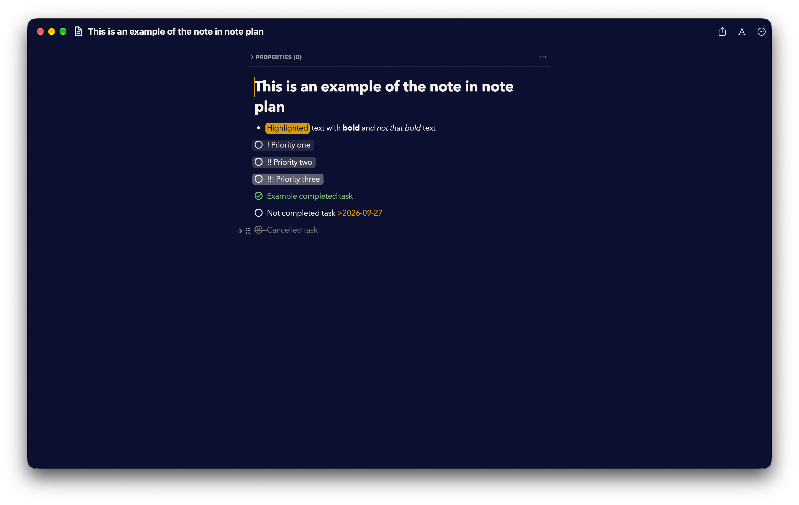
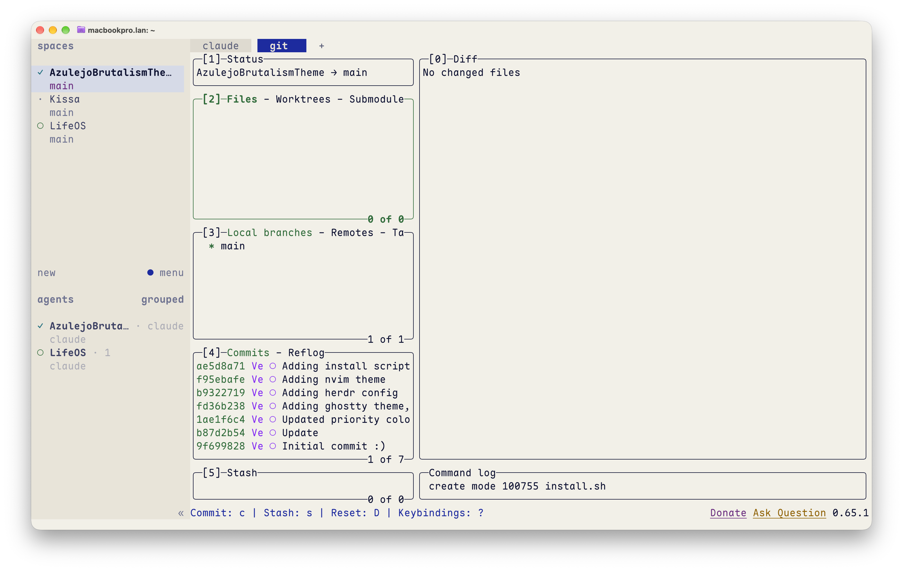
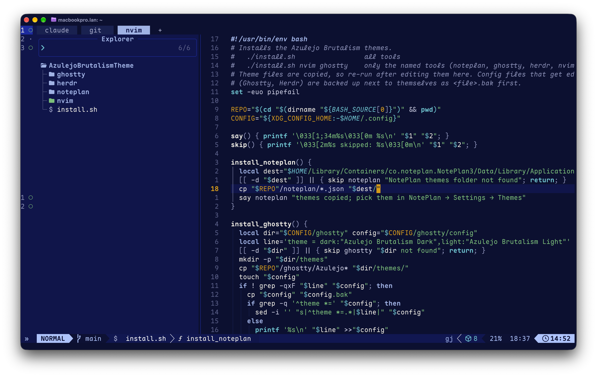
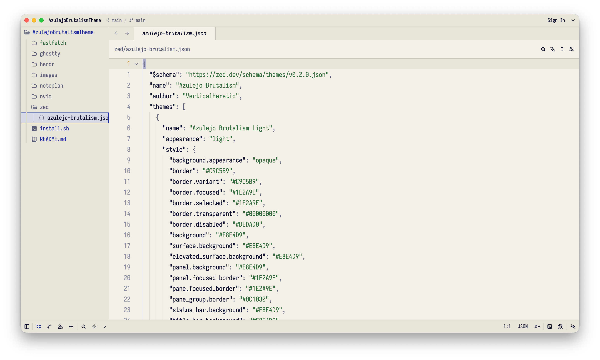
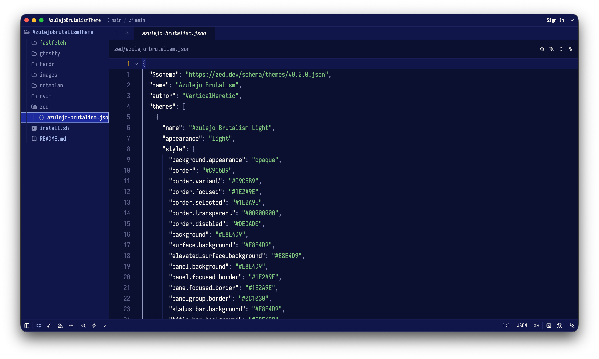
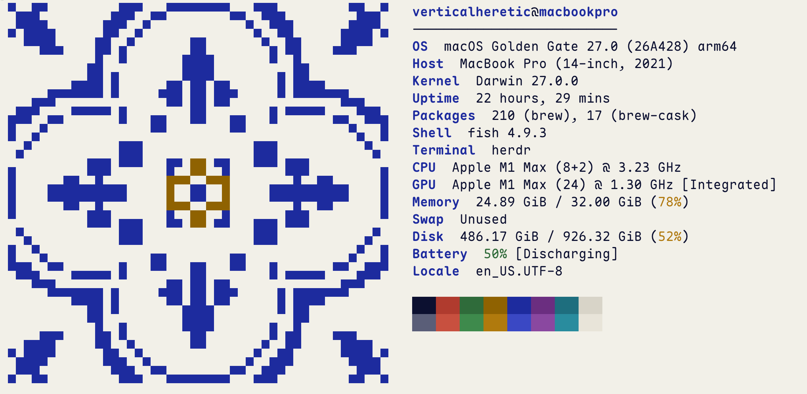

# Azulejo Brutalism

Color scheme/theme for different tools, created by love for Brutalism and Azulejo tilework.

## Install

```sh
./install.sh                 # all tools
./install.sh nvim ghostty    # only some: noteplan, ghostty, herdr, nvim, zed, fastfetch, xcode, vscode, jetbrains
./install.sh --oled          # true-black OLED variant instead of Dark
```

**OLED** is Dark with a pure `#000000` background and near-black surfaces; accents are unchanged. With `--oled` the script sets it as the dark theme in Ghostty, Herdr, Zed, Xcode and Neovim (via `vim.g.azulejo_brutalism_oled = true`). In NotePlan, VS Code and JetBrains, pick "Azulejo Brutalism OLED" yourself.

Re-run after editing a theme. Edited configs are backed up as `*.bak`.

- **NotePlan:** choose the Light and Dark themes in Settings → Themes.
- **Ghostty:** reload the config with ⌘⇧,
- **Herdr:** the script reloads it for you.
- **Neovim:** becomes LazyVim's colorscheme on the next start.
- **Zed:** switches right away and follows the system appearance.
- **Fastfetch:** run `fastfetch`; the tile uses the terminal's blue and yellow.
- **Xcode:** set automatically if Xcode is closed; otherwise pick them in Settings → Themes.
- **VS Code / Cursor:** restart, then choose Azulejo Brutalism Light/Dark as the preferred light and dark themes.
- **Android Studio / JetBrains:** restart, then pick the scheme in Settings → Editor → Color Scheme (or import the `.icls` from `jetbrains/`).

## NotePlan

| Light                                        | Dark                                       |
| -------------------------------------------- | ------------------------------------------ |
|  |  |

## Ghostty + Herdr

| Light                                  | Dark                                 |
| -------------------------------------- | ------------------------------------ |
|  |  |

## Neovim

| Light                                  | Dark                                 |
| -------------------------------------- | ------------------------------------ |
|  |  |

## Zed

| Light                              | Dark                             |
| ---------------------------------- | -------------------------------- |
|  |  |

## Fastfetch

| Light                                          | Dark                                         |
| ---------------------------------------------- | -------------------------------------------- |
|  |  |

## Xcode

| Light                                  | Dark                                 |
| -------------------------------------- | ------------------------------------ |
|  |  |
