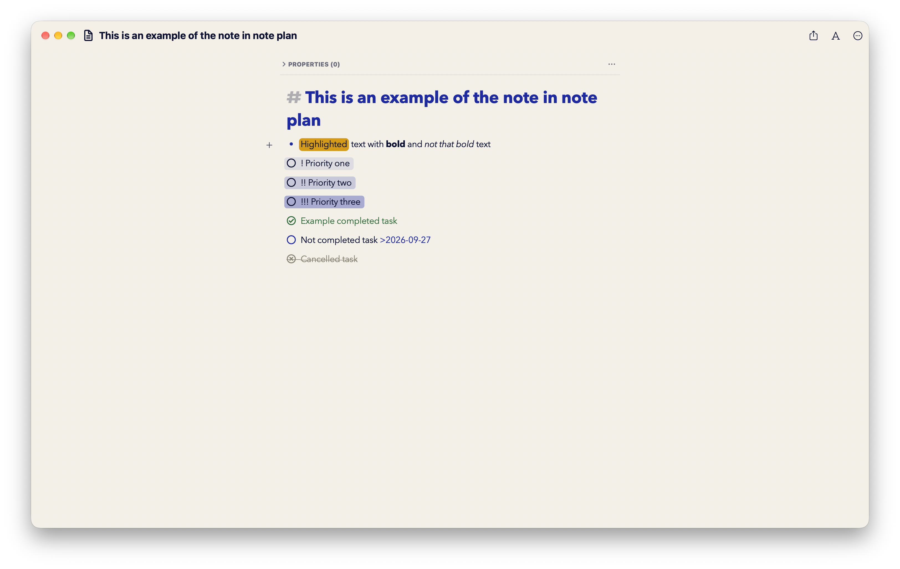
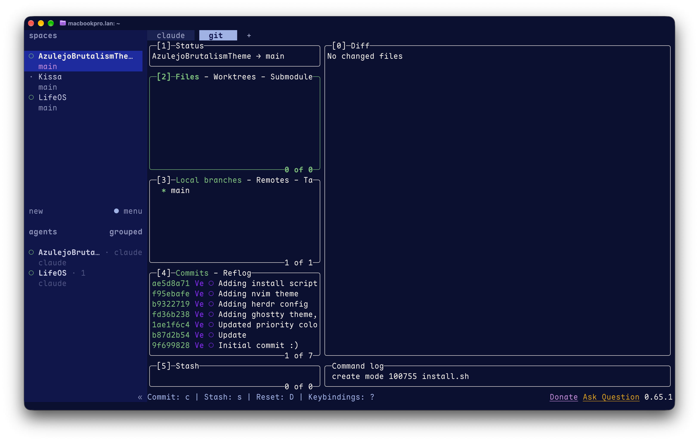
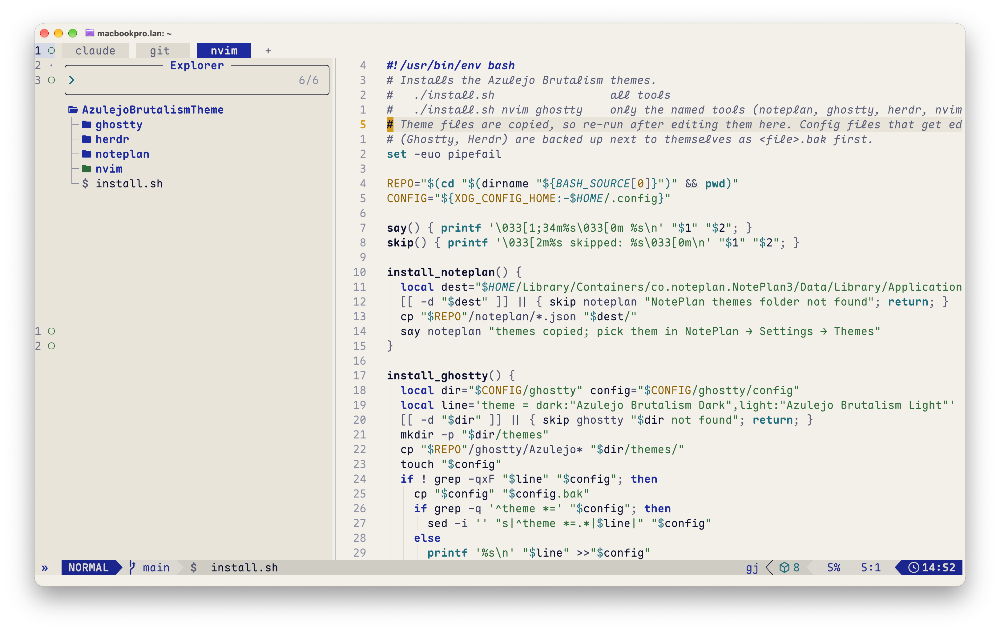
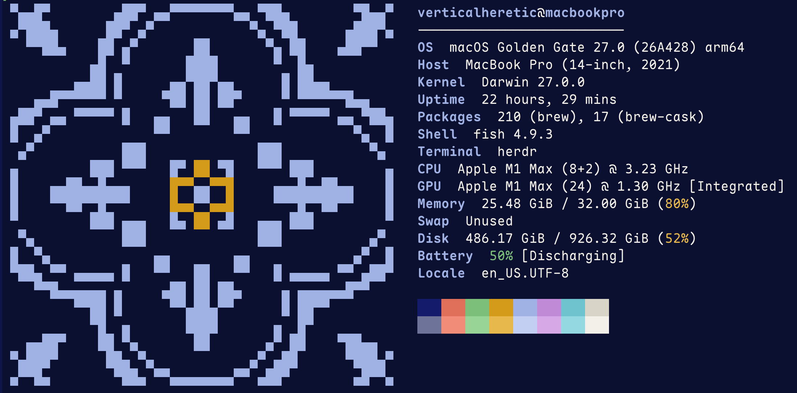
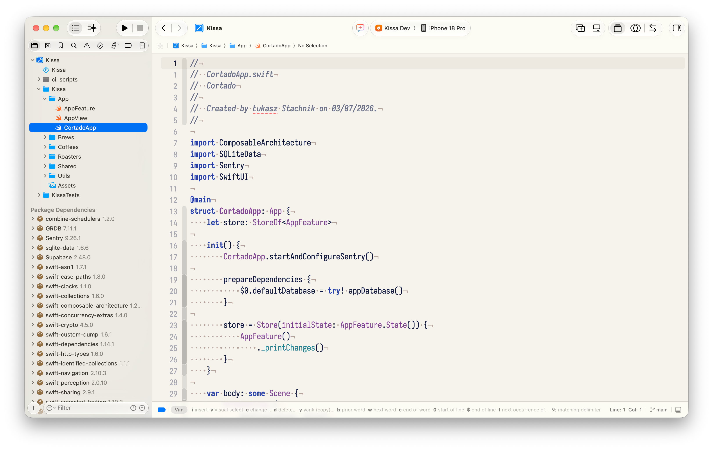
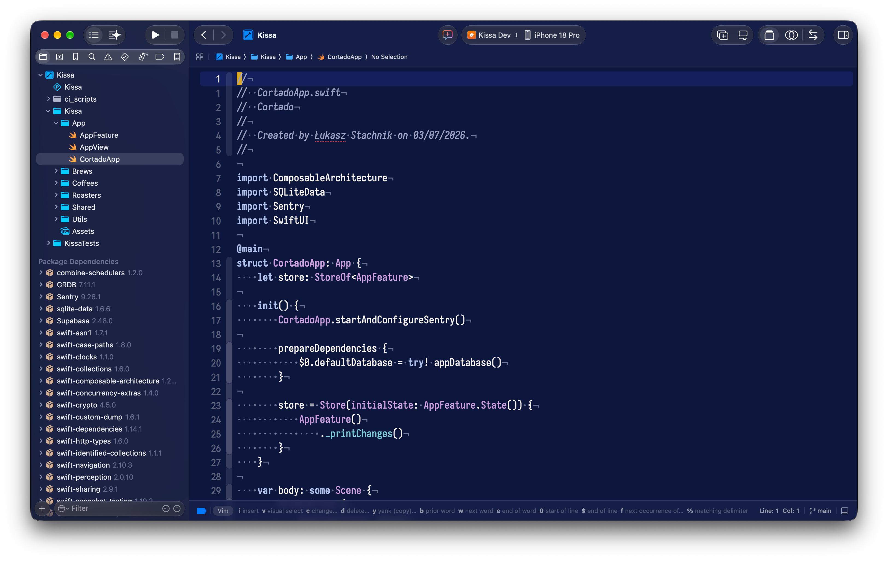

# Azulejo Brutalism

Color scheme/theme for different tools, created by love for Brutalism and Azulejo tilework.

## Install

```sh
./install.sh                 # all tools
./install.sh nvim ghostty    # only some: noteplan, ghostty, herdr, nvim, zed, fastfetch, xcode, vscode, jetbrains, noctalia, obsidian, vibe
./install.sh --oled          # true-black OLED variant instead of Dark
```

**OLED** is Dark with a pure `#000000` background and near-black surfaces; accents are unchanged. With `--oled` the script sets it as the dark theme in Ghostty, Herdr, Zed, Xcode, Neovim (via `vim.g.azulejo_brutalism_oled = true`), Noctalia (via `pure_black_dark = true`), Vibe (via `theme` in `~/.vibe/config.toml`) and Obsidian (via the theme's OLED dark toggle in the Style Settings plugin). In NotePlan, VS Code and JetBrains, pick "Azulejo Brutalism OLED" yourself.

Re-run after editing a theme. Edited configs are backed up as `*.bak`.

- **NotePlan:** choose the Light and Dark themes in Settings → Themes.
- **Ghostty:** reload the config with ⌘⇧,
- **Herdr:** the script reloads it for you.
- **Neovim:** becomes LazyVim's colorscheme on the next start.
- **Zed:** switches right away and follows the system appearance.
- **Fastfetch:** run `fastfetch`; the tile uses the terminal's blue and yellow.
- **Xcode:** set automatically if Xcode is closed; otherwise pick them in Settings → Themes.
- **VS Code / Cursor:** restart, then choose Azulejo Brutalism Light/Dark as the preferred light and dark themes.
- **Obsidian:** installed into every vault Obsidian knows about, and set if Obsidian is closed; otherwise pick it in Settings → Appearance → Themes. Its options (OLED dark, uppercase labels, heading rules) are in the Style Settings plugin. Or install it from the community themes (Settings → Appearance → Themes → Manage); the theme lives in [azulejo-brutalism-obsidian](https://github.com/VerticalHeretic/azulejo-brutalism-obsidian), a submodule here.
- **Android Studio / JetBrains:** restart, then pick the scheme in Settings → Editor → Color Scheme (or import the `.icls` from `jetbrains/`).
- **Noctalia:** the palette JSON is copied into `~/.config/noctalia/palettes/` and set as the theme source (`source = "custom"`) in `~/.config/noctalia/config.toml`. Noctalia applies it live, no restart; check with `noctalia config validate`. Light and Dark variants come from the same file; `--oled` turns on `pure_black_dark` for the true-black variant.
- **Mistral Vibe:** installed into Vibe's Python environment (`azulejo_brutalism.py` plus a `.pth` startup hook) and set as `theme` in `~/.vibe/config.toml`. Vibe's TUI is Textual, which has no theme-file format — the hook registers the themes as if they were built-in, so all three variants (light/dark/oled) also appear in Vibe's `/theme` picker. Restart vibe to see it; Python (Textual) TUI only, not the experimental Rust TUI. Uninstall: remove the two `azulejo_brutalism*` files from the `site-packages` shown by the installer. Reinstalling or upgrading mistral-vibe replaces its environment — re-run the script after.

## NotePlan

| Light                                        | Dark                                       |
| -------------------------------------------- | ------------------------------------------ |
|  |  |


## Obsidian

Source and options (OLED, uppercase labels, heading rules via Style Settings): [azulejo-brutalism-obsidian](https://github.com/VerticalHeretic/azulejo-brutalism-obsidian).

## Ghostty + Herdr

| Light                                  | Dark                                 |
| -------------------------------------- | ------------------------------------ |
|  |  |

## Neovim

| Light                                  | Dark                                 |
| -------------------------------------- | ------------------------------------ |
|  |  |

## Zed

| Light                              | Dark                             |
| ---------------------------------- | -------------------------------- |
|  |  |

## Fastfetch

| Light                                          | Dark                                         |
| ---------------------------------------------- | -------------------------------------------- |
|  |  |

## Xcode

| Light                                  | Dark                                 |
| -------------------------------------- | ------------------------------------ |
|  |  |

